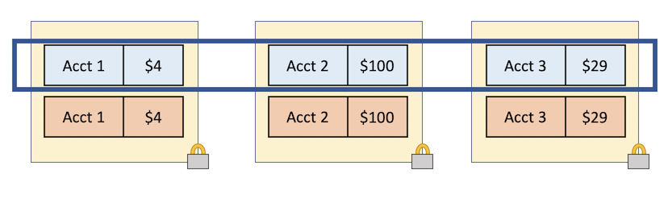
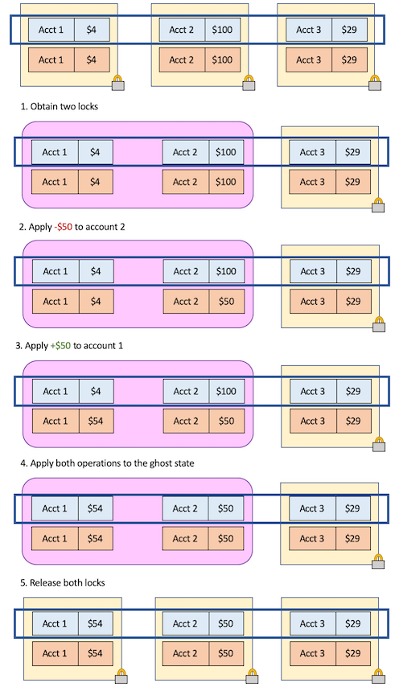

Here, we will explain how to use a Sharded State Machine (SSM) to assist in our concurrent implementation.

## Theory

The idea is that we will make the SSM available to the implementation as _ghost state_.
The implementation will be allowed to manipulate ghost _tokens_ that represent shards of
the state. Again, these 'ghost tokens' do not really exist and will not exist in a compiled
binary.  However, for the purpose of verification, we imagine that these tokens are there.

Our system architecture will use the Mutexes from [MutexIntro.md](MutexIntro.md).
We will store one account and its balance behind each mutex. 
Furthermore, each mutex will store this balance bost _physically_ and _ghostily_.

This diagram illustrates the architecture (we show only 3 accounts for simplicity):



Each yellow box indicates a mutex. The blue boxes represent the ghost state,
while the orange boxes represent physical state.

There are two notions of an “invariant” here:

 * Each mutex establishes an invariant between the physical state and the ghost state (stating that the account ID and amount of money match)
 * The ghost state are tokens representing shards of a state machine. They are governed by the state machine protocol, and are therefore subject to the invariant of that protocol (represented by the long blue box).

Now, a program can execute a transition with the following steps (say, we want to move
$50 from account 2 to account 1).

1. Acquire the locks on accounts 1 and 2. In doing so, acquire the invariants between the ghost state and the physical state.
2. Subtract $50 from account 2.
3. Add $50 to account 1.
4. Perform the same transfer on the ghost state (subtract $50 from account 2, and add $50 to account 1). Since we are operating on ghost state here, this can be done atomically. Furthermore, this operation corresponds to a sharded transition, as defined on the previous
page.
5. Release both locks. Note that the mutex invariants have been restored, so we can do
the release.

Here are the above steps, presented graphically (the purple box represents thread-owned state):


Note that the global invariant (blue box) is always maintained, which can
happen because the update to the global (ghost) state happens atomically (at
step 4). Other concurrent threads can exploit that global invariant even as
they ignore the fact that the physical values for the locked accounts don't
match the ghost values.

## Code

By defining a SSM as we did on the previous page, the concurrency framework will create for us a _Token_ object. The Token can be manipulated as `glinear` (again, [‘ghost linear’](GhostLinearIntro.md)).
For now, I'll just show you want the interface looks like, and suffice it to say that the framework lets us obtain this Token type, and several ghost methods for manipulating it:

[code/BankImplementation.md](code/BankImplementation.md)
```dafny
// Every token corresponds to some "shard" of the state machine.
// The tokens are not "real" (i.e., they don't appear in a compiled binary).
// They are 'ghost linear' (glinear).
type {:extern} Token {
  function value() : Bank.Shard
}

/*
 * Given 2 tokens, glue their shards together according to the monoidal structure
 * defined by the bank SSM, thus returning just a single token.
 */
glinear method glue(glinear a: Token, glinear b: Token)
returns (glinear c: Token)
ensures c.value() == Bank.glue(a.value(), b.value())

/*
 * Do the opposite - split a token into two.
 * The split_1 and split_2 arguments allow the caller to specify how they
 * want the token to be split.
 */
glinear method split(glinear c: Token,
    ghost split_1: Bank.Shard,
    ghost split_2: Bank.Shard)
returns (glinear a: Token, glinear b: Token)
requires c.value() == Bank.glue(split_1, split_2)
ensures a.value() == split_1
ensures b.value() == split_2

/*
 * Given a shard, perform a transition as allowed by the SSM.
 * In this case, the allowed transitions are given by the Bank.Transfer predicate.
 */
glinear method perform_transfer(
    glinear token: Token,
    ghost shard: Bank.Shard,
    ghost shard': Bank.Shard,
    ghost transfer: Bank.AccountTransfer)
returns (glinear token': Token)
requires token.value() == shard
requires Bank.Transfer(shard, shard', transfer)
ensures token'.value() == shard'

/*
 * For any token that exists in the program, its shard must be the sub-shard
 * of some whole which meets the SSM's invariant. This "lemma"
 * (expressed as a glinear method) simply says that this is mathematically possible.
 * The parameter is 'gshared' (i.e., calling this method does not consume the token).
 */
glinear method get_invariant(gshared token: Token)
ensures exists rest :: Bank.Inv(Bank.glue(token.value(), rest))
```

These tokens can be derived from the theory of PCM ghost state in concurrent separation logics.

But this is how I think about these tokens intuitively: the tokens are spread all over the
program (e.g., in memory, in control of different threads, etc.) but if we take a snapshot
of the execution at any point, we could collect all the tokens, that is, all the shards,
glue them together, and get a 'complete' state of the SSM. During program execution,
threads can pass these around, but the only way they can _change_ the states is by performing
the transitions defined by the SSM. Therefore, that 'complete state' snapshot must evolve
according to the SSM transition rules; therefore, it must always satisfy the invariant.

Now, let's gone with making use of these tokens.

For our implementation, we'll be maintaining a data structure containing a bunch of mutexes,
one for each account. Each mutex should have an invariant, and that invariant will be
dependent on the account ID. For example, the first mutex in the sequence (mutex 0) will
have an invariant that it contains a ghost token corresponding to account 0. The invariant
will also say that the balance stored in the ghost token will match the number _physically_
stored in the mutex.

```dafny
linear datatype AccountEntry = AccountEntry(
    balance: nat,
    glinear token: SSMTokens.Token
  )

predicate Inv(accountId: nat, entry: AccountEntry) {
  entry.token.value() == Bank.Shard(map[accountId := entry.balance])
}

datatype AccountSeq = AccountSeq(accounts: seq<Mutex<AccountEntry>>)
{
  predicate WellFormed()
  {
    && |this.accounts| == Bank.NumberOfAccounts
    && (forall accountId | 0 <= accountId < Bank.NumberOfAccounts ::
        forall entry ::
          this.accounts[accountId].inv(entry) <==> Inv(accountId, entry)
    )
  }
}
```

Here's some code for doing an account transfer.

```dafny
/*
 * Do the transfer (but only if the source account has enough money)
 * Return 'true' on success (the return value is not verified in any sense)
 */
method TryAccountTransfer(
    accountSeq: AccountSeq,
    sourceAccountId: nat,
    destAccountId: nat,
    amount: nat)
returns (success: bool)
requires accountSeq.WellFormed()
requires 0 <= sourceAccountId < Bank.NumberOfAccounts
requires 0 <= destAccountId < Bank.NumberOfAccounts
requires sourceAccountId != destAccountId
{
  var accounts := accountSeq.accounts;

  // 1. Acquire the two mutexes

  linear var sourceAccountEntry, destAccountEntry;
  glinear var handle1, handle2;
  sourceAccountEntry, handle1 := accounts[sourceAccountId].acquire();
  destAccountEntry, handle2 := accounts[destAccountId].acquire();

  // unpack the datatypes to the physical state (sourceBalance and destBalance)
  // and the ghost state (sourceToken and destToken)

  linear var AccountEntry(sourceBalance, sourceToken) := sourceAccountEntry;
  linear var AccountEntry(destBalance, destToken) := destAccountEntry;

  var newSourceBalance: nat;
  var newDestBalance: nat;

  if amount <= sourceBalance {
    // 2. Update the source balance.

    // (We do this all on the stack, but an alternative implementation might have
    // us update a shared memory cell, which we would gain exclusive access to via
    // the mutex.)

    newSourceBalance := sourceBalance - amount;

    // 3. Update the dest balance.

    newDestBalance := destBalance + amount;

    // 4. Ghost update here

    ////////////////////////////
    ////////////////////////////

    // This is the interesting bit, although it's a little bogged down in boilerplate.
    // We have 2 tokens, so we start by gluing them together into a single token
    // which contains both accounts.

    glinear var twoAccountToken := SSMTokens.glue(sourceToken, destToken);

    // Our Bank SSM defines an 'AccountTransfer' transition, which allows a transition
    // on a shard that has 2 accounts in it:

    glinear var twoAccountToken' := SSMTokens.perform_transfer(twoAccountToken,
        Bank.Shard(map[sourceAccountId := sourceBalance, destAccountId := destBalance]),
        Bank.Shard(map[sourceAccountId := newSourceBalance, destAccountId := newDestBalance]),
        Bank.AccountTransfer(sourceAccountId, destAccountId, amount));

    // Now we split our transformed state back into two tokens.

    sourceToken, destToken := SSMTokens.split(twoAccountToken',
        Bank.Shard(map[sourceAccountId := newSourceBalance]),
        Bank.Shard(map[destAccountId := newDestBalance]));

    ////////////////////////////
    ////////////////////////////

    success := true;
  } else {
    newSourceBalance := sourceBalance;
    newDestBalance := destBalance;

    success := false;
  }

  // 5. Release the locks

  accounts[sourceAccountId].release(AccountEntry(newSourceBalance, sourceToken), handle1);
  accounts[destAccountId].release(AccountEntry(newDestBalance, destToken), handle2);
}
```

Now, you may note that this doesn't really verify anything useful. We've gone through
a lot of trouble to set up the ghost tokens, and here we have an implementation which verifies
that it uses those tokens correctly—but it still doesn't really tell us anything about
the balances that we didn't already know. So let's rememdy that, and see what this
methodology can actually give us!

Recall that when we set up the SSM, we declared that there would be only a total of
$300 in the bank. Therefore, any single account should have at most $300 in it.

Note that this follows from an invariant we declared on the SSM—but it wouldn't have followed
from the mutex invariants alone!

(Now, perhaps you think, as an alternative, we could declare a per-mutex invariant that
the balance inside was at most $300. But then, we couldn't have implemented `TryAccountTransfer`
as-is. We would either have to do a runtime check that the new balance was at most $300,
or we would have to prove it—which brings us back around.)

Now, since we _do_ have the ghost state, we can use it to obtain the SSM's invariant
and therefore show that a single account has at most $300. (In fact, we could do this for
any subset of accounts if we wished.)

```dafny
method AssertAccountIsNotTooRich(
    accountSeq: AccountSeq,
    accountId: nat)
requires accountSeq.WellFormed()
requires 0 <= accountId < Bank.NumberOfAccounts
{
  var accounts := accountSeq.accounts;

  linear var accountEntry;
  glinear var handle;
  accountEntry, handle := accounts[accountId].acquire();

  linear var AccountEntry(balance, token) := accountEntry;

  SSMTokens.get_invariant(token);

  // This assertion doesn't follow from the invariant of a single mutex!
  // But we can derive it from the global protocol governing the bank accounts.
  assert balance <= 300 by {
    // Here's how. (Most of the assertions here aren't necessary, and only serve
    // as documentation.)

    // We've got a token (corresponding to a shard totally just the 1 bank account).
    // The above call (get_invariant) lets us learn that this shard must be a subcomponent
    // of a large _complete_ state that satisfies the invariant proved in the
    // Bank_ShardedStateMachine. Let's obtain that shard, call it 'full'.
    ghost var rest :| Bank.Inv(Bank.glue(token.value(), rest));
    ghost var full := Bank.glue(token.value(), rest);
    assert Bank.Inv(full);

    // It's worth keeping in mind that 'full' here isn't a token. We haven't magically
    // obtained all the tokens in the system, or pulled them out of the mutexes.
    // It's just a mathematical construct that we obtained from an existential first-order
    // logic formula.

    // Anyway, since the 'full' shard contains the 'token.value()' shard as a
    // sub-component, it should have the accountId -> balance mapping in it.

    assert balance == full.account_balances[accountId];

    // The single balance is <= the sum of all balances. This is just a math lemma.

    AdditionalMathUtils.lemma_single_elem_le_sum_of_map(
        accountId,
        Bank.MapToSeq(full.account_balances));
    assert full.account_balances[accountId]
        <= MathUtils.sum(Bank.MapToSeq(full.account_balances));

    // Now, the sum of all balances is Bank.FixedTotalMoney.
    // We get this from Bank.Inv(full).

    assert MathUtils.sum(Bank.MapToSeq(full.account_balances)) == Bank.FixedTotalMoney;

    // And this constant was defined to be 300:

    assert Bank.FixedTotalMoney == 300;

    // So in the end we derive:

    assert balance <= 300;
  }

  accounts[accountId].release(AccountEntry(balance, token), handle);
}
```

See [code/BankImpl.dfy](code/BankImpl.dfy) for the full example.
