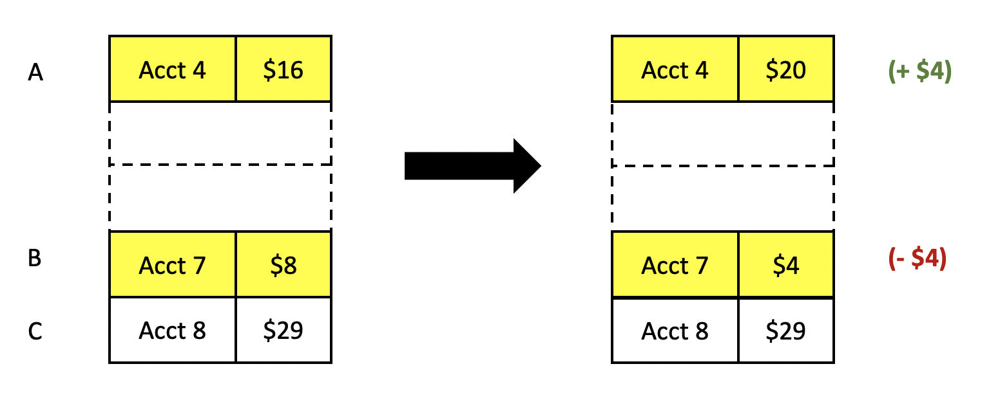

From the earlier sections, we should now be familiar with the concept that in concurrent verification, we often have some _ghost state_, and we tie that ghost state to physical memory somehow.

Furthermore, many applications will share memory in a read-only fashion (e.g., via a reader-writer lock). It stands to reason, then, that we may want to share ghost state in a similar way.

Linear dafny has a concept of `shared` to go along with its `linear`. It's best to think of `shared` as being like a shared (i.e., not-mut) borrow `&` in Rust; Dafny has very simple rules—much simpler and less powerful than Rust's borrow checker—but the principle is the same. In either case, there are rules that let you turn a `linear` (exclusively owned) object into a `shared` (shared borrow) object, and they make sure that these `shared` objects expire before exclusive access is regained to the original.

Likewise, `glinear` has a corresponding concept of `gshared`. So how does this work?

Let's return to our “bank” example. Let's suppose that instead of our normal transfer
operation, we want to implement a transfer operation that has to check some other condition.
Say, for example, we want to transfer money to account A from account B, but only if
some other account C has >= $10 in it. We don't need to modify this account C, but do we need to check its balance, so a programmer may want to use a reader-writer lock. The transfer operation would open accounts A and B's locks in write (exclusive) mode, and account C in read (shared) mode.

(Okay, yeah, so this bank example is a little forced. A more complicated example might be a hash table, where inserts and updates are done with exclusive locks and queries are done with shared locks. Still, I want something simple, and the bank example will illustrate the ideas.)

If we return to the sharded state machine that represents the bank application, a transition on a shard will now require _three_ bank accounts. However, only two of them are actually modified (highlighted in yellow here):



We already know that we can perform this transition on ghost shard state if we have `glinear` access to this three-account shard.

However, it stands to reason that we should still be allowed to perform this transition even if we have accounts A and B in `glinear` form and account C in `gshared` form.

In fact, our framework lets us do exactly that. The more interesting question becomes how to get this `gshared` in the first place.

We want to be able to somehow get a `gshared` object out of a reader-writer lock when we acquire the lock in shared mode. Of course, we need to ensure that all these `gshared` objects expire by the time the shared lock is released.

(Note: for simplicity, we're going to assume the RwLock only protects ghost state.
If the client wants to protect physical state, they can store a `PointsTo` object in the lock.)

We can do something similar to the way [Rust's RwLock](https://doc.rust-lang.org/std/sync/struct.RwLock.html) works. When you call `read()` on an `RwLock`, you get back a `RwLockReadGuard<T>` object, which you have exclusive access to. Furthermore, you can obtain a borrow of your `T` object from the guard object. Of course, this borrow must expired before you return the guard object.

We'll do exactly the same thing. Our equivalent of `RwLockReadGuard` will be the `SharedHandle`. (Generally, I find shared/exclusive terminology to be a little clearer than read/write.)
A RwLock spec is in [code/RwLock.dfy](code/RwLock.dfy). It's a lot like the previous `Mutex`. Here are the new bits:

```dafny
datatype SharedHandle<V> = SharedHandle(m: RwLock<V>, v: V)

type {:extern} RwLock(==)<V>
{
  /*
   * `acquire_shared`
   * Like acquire, but can be held by more than one client at a time.
   * Returns a handle that can be borrowed from 
   */

  method acquire_shared()
  returns (glinear handle: SharedHandle<V>)
  ensures this.inv(handle.v)
  ensures handle.m == this

  /*
   * `release_shared`
   */

  method release_shared(glinear handle: SharedHandle<V>)
  requires handle.m == this
}

function method {:extern} borrow_shared<V>(gshared handle: SharedHandle<V>)
    : (gshared v: V)
ensures v == handle.v
```

`acquire_shared` gives you access to the `SharedHandle<V>` object.
Furthermore, you can use the `borrow_shared` function to borrow a `gshared V` version of
the object from the `SharedHandle<V>`, and you can use that to perform operations like
the bank operation above, or if `V` represents access to memory, then you can read that
memory but not write to it.

Finally, to release the shared lock, you return the `SharedHandle<V>` to the RwLock.

## Implementing our own RwLock

How might we implement our own, custom RwLock out of atomic primitives, like we did an exclusive lock?

Our language has borrowing rules—but we can't use those alone to implement a RwLock. After all, Rust's own RwLock is implemented via `unsafe` code, and we run into similar problems.

This gets into some of our innovations regarding PCM logics, which we developed for this purpose.

At a high level here is how it goes:

Suppose we want to store some ghost state `G` into a RwLock. We're going to define _another_ ghost state (a Sharded State Machine, in particular) RwLockG, with some special rules: it is possible to “deposit” ghost state G into the RwLockG and “withdraw” that state G back out.  Furthermore, it is possible to “borrow” G-state from the RwLockG-state without actually withdrawing it. The methodology requires the programmer to prove (using invariants of the Sharded State Machine) that borrowed state always corresponds to some state that was deposited.

So for example, we would be able to implement the above interface by creating a Sharded State Machine RwLockG, with certain shards enabling borrowing. The `SharedHandle` objects could be defined to be that state.

An example can be found in [the rwlockimpl/ directory](../rwlockimpl/).
The [RWLock.dfy](../rwlockimpl/RWLock.dfy) file in particular is a good place to start.
